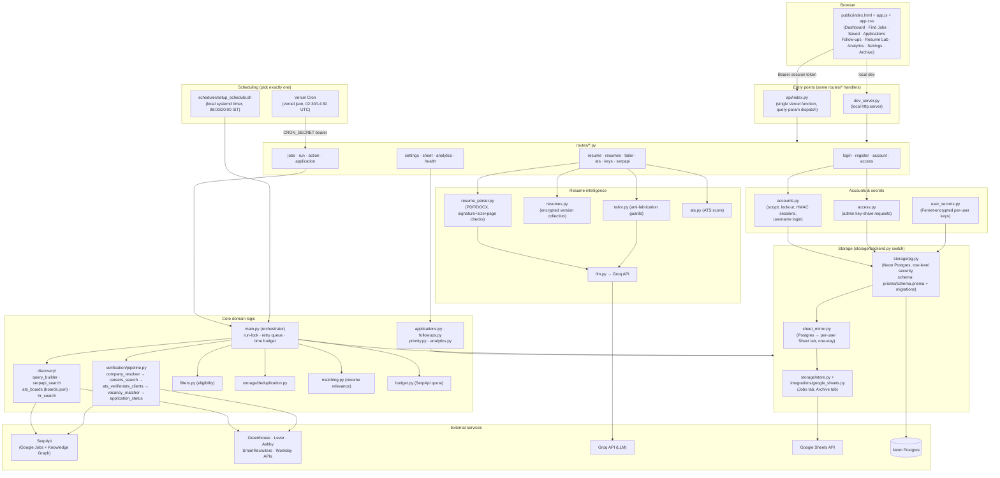

# Architecture

Based entirely on the code actually present in this repository at commit `9f4b6b3`. Nothing below is aspirational.

## Overview

The app is a Python monolith with no separate backend framework (no Flask/Django/FastAPI) — `routes/*.py` modules implement raw HTTP handlers shared between two entry points:

- **`api/index.py`** — the single Vercel serverless function. Vercel's Hobby plan caps a project at 12 functions, so every `/api/<name>` request is routed, via `vercel.json` rewrites, to this one function, which dispatches by name to `routes/<name>.py`.
- **`dev_server.py`** — a local `http.server`-based dev server that dispatches to the *same* `routes/<name>.py` handler classes, so local behavior and production behavior cannot drift apart.

The frontend (`public/index.html`, `app.js`, `app.css`) is static, vanilla JS, no build step, served directly by Vercel or the dev server. It authenticates with a Bearer session token (not cookies — the README notes this sidesteps CSRF), not by server-rendered pages.

There is no separate "backend service" to deploy — the dashboard and API are the same Vercel deployment.

## Job pipeline (the core domain logic)

`main.py` is the orchestrator, invoked either from the CLI, from `routes/run.py` (dashboard-triggered or cron-triggered), or from the local systemd timer:

1. **Discovery** (`discovery/`) — builds SerpApi queries for fresher/graduate/junior/Data Analyst/Data Engineer roles (`query_builder.py`), runs them (`serpapi_search.py`), and separately polls a curated allowlist of employer ATS boards (`ats_boards.py`, backed by `boards.json`) and does a best-effort HR-contact search (`hr_search.py`). All outbound HTTP goes through `http_client.py` (retry/backoff, per-host politeness, robots.txt checks, secret redaction in logs).
2. **Filtering** (`filters.py`) — India/remote-for-India eligibility, fresher/experience bounds, age-of-posting.
3. **Deduplication** (`storage/deduplication.py`) — merges duplicate postings across sources, preferring the more-verified copy.
4. **Verification** (`verification/pipeline.py`) — an 8-gate sequential check (employer identity via Google Knowledge Graph/Wikidata → official website → careers page on that same domain → ATS-board link trust → exact vacancy/title/location/requisition-ID match → real open/closed determination → apply-URL ownership → eligibility), producing one of exactly four statuses: `VERIFIED`, `NEEDS_REVIEW`, `REJECTED`, `CLOSED`. Evidence is written to `logs/verification-<date>.jsonl`. Jobs that fail for a transient reason (budget exhausted, network error) go into a retry queue (`storage/store.py`: 5 jobs/run, 3 attempts, 12h apart).
5. **Matching** (`matching.py`) against the user's resume profile — a relevance score, kept deliberately separate from verification confidence.
6. **Persistence** via the storage abstraction (below).
7. **Budget tracking** (`budget.py`) caps SerpApi calls per run and per month, splitting the quota between job search, employer lookups (cached), and HR lookups.

## Storage: two interchangeable backends

`storage/backend.py` selects a backend at runtime based on `STORAGE_BACKEND`/`DATABASE_URL`:

- **Single-user: Google Sheets** (`storage/store.py` + `integrations/google_sheets.py`) — the `Jobs` tab is the database; an `Archive` tab holds cleared jobs (never deleted); service-account auth via `gspread`.
- **Multi-user: Neon Postgres** (`storage/pg.py`, schema in `prisma/schema.prisma`, migrations in `prisma/migrations/`) — every table carries `user_id`; Postgres row-level security is **forced** (even the owning role can't bypass it — migration `0003` creates a separate, deliberately-restricted `app_rls` role for the app to connect as). `accounts.py` handles scrypt password hashing, lockout, HMAC session tokens, and (as of migration `0004`) username login and admin API-key-sharing requests (`access.py`). `user_secrets.py` Fernet-encrypts each user's own SerpApi/Groq keys.
- **`sheet_mirror.py`** — in multi-user mode, optionally mirrors each user's Postgres data into their own Google Sheet tab (`Jobs - <email>`), one-way, best-effort, never reading the tab back.

## Resume intelligence

- `resume_parser.py` extracts text from an uploaded PDF/DOCX, validating file signature, size (3MB), and page count (10) server-side.
- `llm.py` sends the extracted text to the **Groq API** to build a structured, editable candidate profile; `resumes.py` stores named, encrypted resume versions (up to 20).
- `matching.py` scores a job against the profile (required skills, experience, title, location/mode, preferred skills, education), capping the score at 25 if a hard eligibility requirement (experience/location) fails.
- `ats.py` scores a resume against a job description using a separate ATS-style keyword/structure heuristic.
- `tailor.py` produces tailoring suggestions and a draft, with explicit anti-fabrication guards (rejects invented numbers, requires bullet suggestions to originate from a real bullet, flags unused keywords as "add only if true").

## Cross-cutting concerns

- **Config** (`config.py`) validates all required env vars at startup and fails closed with a clear error, never logging values.
- **Secret handling** — redaction filter on all log output (`http_client.py`); per-user secrets Fernet-encrypted at rest; `/api/health` reports config *presence* (booleans) only.
- **Scheduling** — exactly one of two paths is meant to be active at a time: a local **systemd timer** (`scheduler/setup_schedule.sh`) running `main.py` directly, or **Vercel Cron** (`vercel.json`) hitting `/api/run` with a `CRON_SECRET` bearer token. Both are implemented; neither is currently active in this environment.

## Architecture diagram

## What does NOT exist (confirmed by code inspection)

- No separate database for job data in single-user mode — Google Sheets *is* the database.
- No message queue, no background worker process — runs happen synchronously within a single `main.py` invocation, bounded by the Vercel 240s self-imposed budget (300s platform limit).
- No notification provider (email/SMS/push) is wired up anywhere in the code — "Follow-ups" surfaces reminders in the dashboard only, it does not push anything to the user.
- No LinkedIn scraping or access-control bypass anywhere — `hr_search.py` only parses Google's own result snippets.
- No client-side framework/build step for the frontend — plain HTML/CSS/JS.
